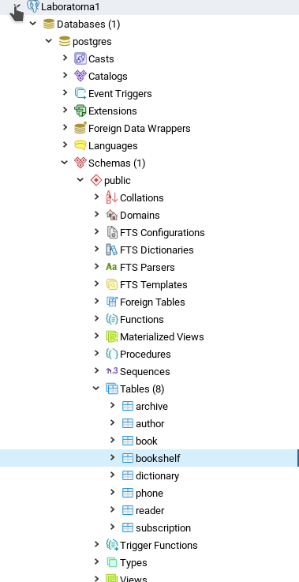
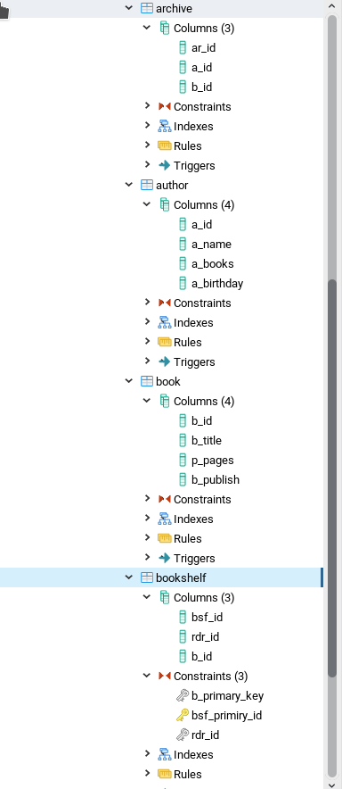
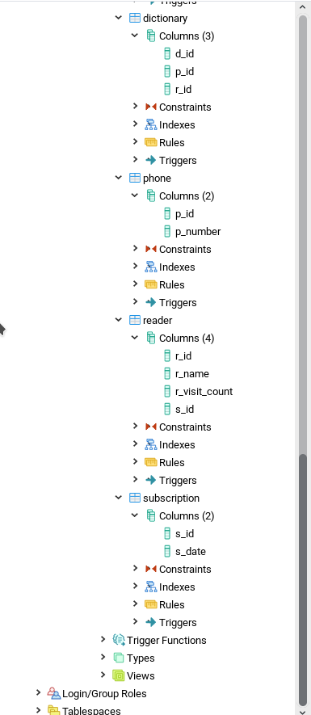
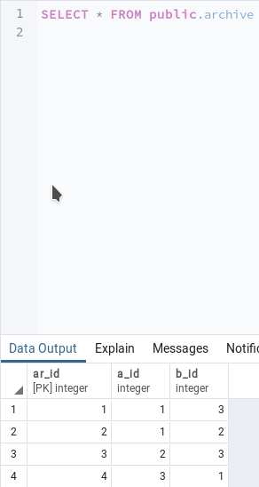
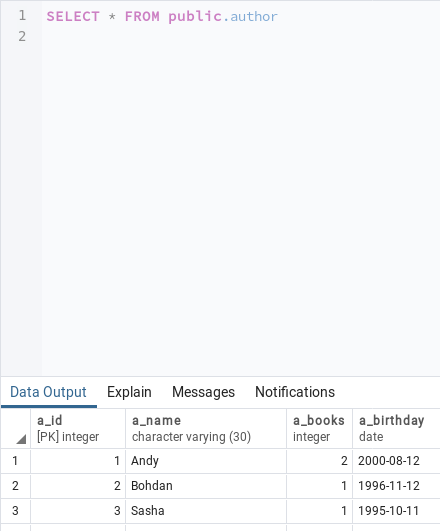
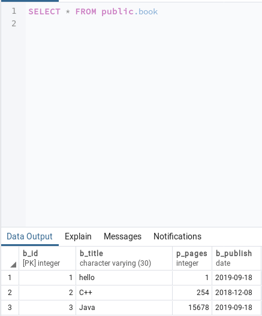
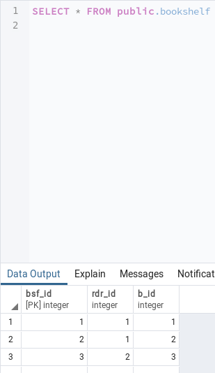
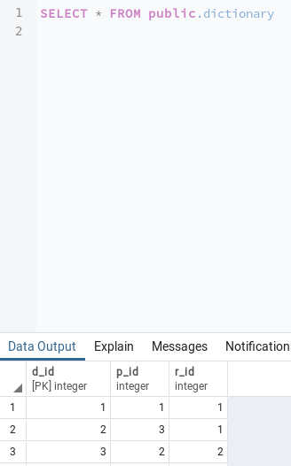
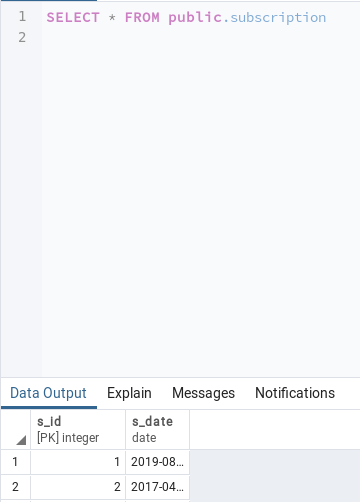
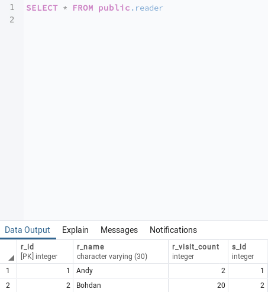

# Lab1_DB
Database lab1, FAM

<h3 align="center">Метою роботи є здобуття практичних навичок створення реляційних баз даних за допомогою PostgreSQL</h3>

<h4>Завдання роботи полягає у наступному:</h4>
<ul>
<li>Ознайомитись із інструментарієм PostgreSQL та pgAdmin 4;</li>
<li>Провести аналіз та опис предметної галузі;</li>
<li>Розробити модель «сутність-зв’язок» предметної галузі, обраної студентом самостійно, відповідно до пункту «Вимоги до ER-моделі»;</li>
<li>Перетворити розроблену модель у схему бази даних (таблиці) PostgreSQL та внести декілька рядків даних у кожну з таблиць засобами pgAdmin 4.</li>
  </ul>

<h4 align="center">Опис предметної галузі</h4>
При проектуванні Бібліотеки можна виділити такі сутності: книжка, читач, автор, перепустка, телефон. У однієї книжки може бути більше ніж один автор і навпаки (зв’язок багато до багатьох). У кожного читача може бути багато книжок (зв’язок багато до багатьох), одна перепустка (зв’язок один до одного) та багато телефонів (зв’язок багато до одного).

<h4 align="center">Концептуальна модель учбової предметної області "Бібліотека"</h4>

<h4 align="center">Опис структури БД “Бібліотека”</h4>

<h4 align="center">Структура БД “Бібліотека”</h4>

<h4 align="center">Фотографії таблиць з БД</h4>

![Table-11](images/11.png
