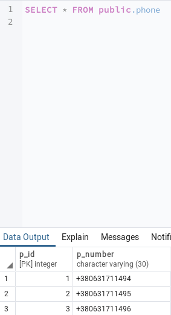

# Lab1_DB
Database lab1, FAM

***Завдання роботи полягає у наступному:***
1. Ознайомитись із інструментарієм PostgreSQL та pgAdmin 4.
2. Розробити модель «сутність-зв’язок» предметної галузі, обраної студентом самостійно, відповідно до пункту «Вимоги до ER-моделі».
3. Перетворити розроблену модель у схему бази даних (таблиці) PostgreSQL та внести декілька рядків даних у кожну з таблиць засобами pgAdmin 4.

***Концептуальна модель учбової предметної області 
"Бібліотека"***

***Опис структури БД “Бібліотека”***

***Структура БД “Бібліотека”***

***Фотографії таблиць з БД***

